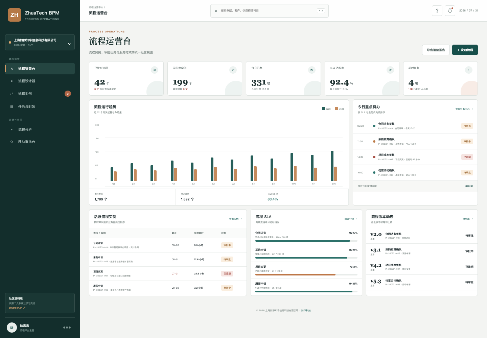
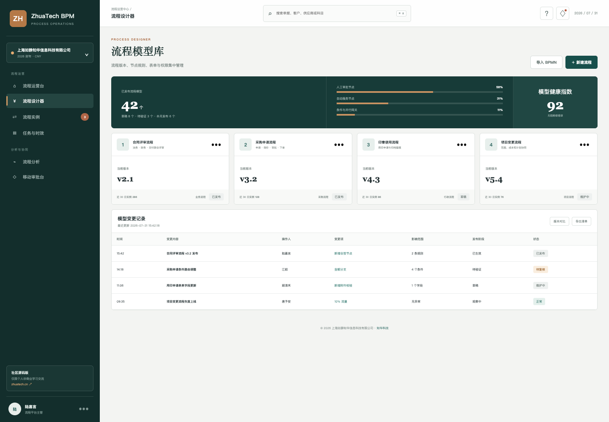
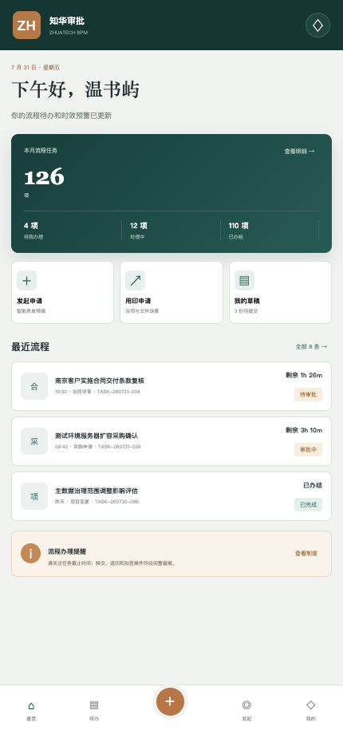

# ZhuaTech BPM · 业务流程管理社区源码版

把合同评审、采购申请、用印、项目变更和权限申请放进一套有规则、有时效、有记录的流程平台。

ZhuaTech BPM 由 [知华科技](https://www.zhuatech.cn/)（上海如静知华信息科技有限公司）研发，采用 Java + Vue + MySQL 前后端分离架构，同时提供流程管理端和移动审批端。

## 今天的流程运营情况



运营台关注运行实例、今日已办、SLA 达标率、超时任务、活跃流程与版本动态，不用逐个部门追问审批进度。

## 模型不是图片，而是可治理的版本



流程模型保留版本、节点类型、条件路由、表单权限、发布阶段和变更记录。社区版提供可扩展的数据结构与 REST 接口骨架。

## 审批人也有简洁的 H5 工作台



移动端展示个人待办、剩余 SLA、最近流程和办理提醒，适合继续扩展同意、退回、转交、加签和意见留痕。

## 功能地图

```text
流程模型库 ── 发布版本 ── 发起实例 ── 节点路由
     │                                │
表单与权限                       个人 / 团队待办
     │                                │
变更记录  ←── 运营分析 ←── SLA 与催办 ←── 办理留痕
```

当前包含：流程运营台、流程模型、流程实例、任务与 SLA、移动审批、JWT 登录、角色权限、MySQL/Flyway、演示数据、Docker Compose、接口文档和 CI 工作流。

## 技术名片

- Java 包名：`cn.zhuatech.bpm`
- 后端：Java 21、Spring Boot、Security、JPA、Flyway、MySQL 8
- 前端：Vue 3、Vue Router、Pinia、Axios、Vite
- API：`/api/bpm`
- 数据库：`zhuatech_bpm`

## 运行

```bash
# 无需后端，直接体验完整页面
cd frontend
npm install
npm run dev:demo
```

访问 `http://localhost:5173`，账号 `admin / admin123`。完整环境可在根目录复制 `.env.example` 后运行 `docker compose up --build`，务必替换示例数据库密码和 `JWT_SECRET`。

## 可继续扩展

BPMN 2.0 设计器、会签/或签、子流程、定时边界事件、服务任务、表达式、组织代理、委托转办、消息中心、电子签章、流程归档、租户隔离与审计报表。

## 许可说明

本项目仅允许个人非商业学习交流，未经书面授权不得用于企业经营、生产部署、SaaS、客户交付、投标、收费培训或其他商业用途。商用须获得上海如静知华信息科技有限公司授权，详见 [LICENSE](LICENSE)。

## 获取商业版本与深度定制

访问 [知华科技官网](https://www.zhuatech.cn/)，或通过以下任一微信二维码咨询流程平台定制、系统集成、私有化部署与商业授权。

| 咨询入口 A | 咨询入口 B |
| --- | --- |
|  |  |

SEO：BPM 开源、业务流程管理系统、工作流系统源码、审批系统、流程引擎、Java BPM、Vue BPM、移动审批、知华科技、上海如静知华信息科技有限公司。

## 流程瓶颈预警

新增 `POST /api/bpm/bottleneck-assessment`，综合节点平均耗时、SLA、运行实例、等待任务和返工率，输出瓶颈分、预测延误小时与治理动作。处理人扩容、代理规则和表单校验改进会根据实际原因按需返回。

## 流程 SLA 仿真

新增 `POST /api/bpm/insights/process-sla-simulation`，使用剩余节点、平均处理时间、并行人数、返工率和剩余 SLA 仿真完工时间，返回 `ON_TRACK / AT_RISK / SLA_MISS` 以及满足时限所需的最小并行人数。流程上线前即可比较资源方案并识别返工风险。

## 审批代理与升级路由

新增 `POST /api/bpm/insights/approval-delegation`，结合待办量、最老任务时长、SLA、主审批人与代理人容量、职责分离冲突及高金额事项，返回 `KEEP_PRIMARY / ACTIVATE_DELEGATION / ESCALATE`，并给出主办、代理和升级任务数量。代理启用过程会保留职责冲突校验与双人复核建议。
